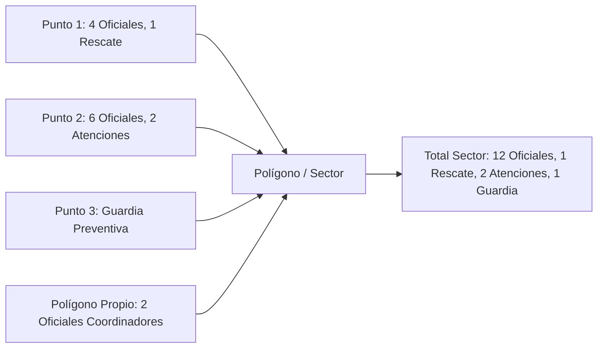

# 📐 Arquitectura del Sistema y Principios de Diseño

Este documento describe la estructura arquitectónica, patrones de diseño y principios aplicados en el desarrollo de la **App de Mapas — COE La Guaira**.

---

## 🏛️ Visión General de la Arquitectura

La aplicación está diseñada bajo una arquitectura modular de capas desacopladas con flujo unidireccional de datos:

```mermaid
flowchart TD
    subgraph UI Layer [Capa de Presentación React]
        MapComp[MapComponent]
        Labels[HtmlPointLabels]
        Popup[CustomMapPopup]
        Pizarra[PizarraOperacionalModal]
        Report[RangeReportModal]
    end

    subgraph State & Hooks [Capa de Estado y Casos de Uso]
        useAppState[useAppState]
        useFeatureDB[useFeatureDB]
        useSpatial[useSpatialHierarchy]
        useSession[useFeaturePopupSession]
    end

    subgraph Domain Layer [Capa de Dominio Puro]
        FLB[featureLogBook]
        LogUtils[logUtils]
        SpatialUtils[spatialUtils]
        MapAnno[mapAnnotationEngine]
        ColorUtils[colorUtils]
    end

    subgraph Persistence Layer [Capa de Persistencia e Integración]
        LogSerial[logSerialization]
        Repo[Repositories IFeatureRepo / ILogRepo]
        SupaImpl[supabaseImpl]
        RxDB[rxdb]
    end

    subgraph External [Servicios Externos]
        Supabase[(Supabase Postgres & Realtime)]
        ArcGIS[ArcGIS Maps SDK CDN]
        GoogleMaps[Google Tile Service]
    end

    UI Layer --> State & Hooks
    State & Hooks --> Domain Layer
    State & Hooks --> Persistence Layer
    Persistence Layer --> External
    Domain Layer -.-> Domain Layer
    Persistence Layer --> Domain Layer
```

---

## 🧩 Patrones de Diseño Implementados

### 1. Patrón Repositorio (Repository Pattern)
Ubicación: [`src/repositories/`](file:///c:/Users/Proteccion%20Civil/Music/App%20de%20mapas/src/repositories/)
- **Contratos:** `IFeatureRepository`, `ILogRepository`, `INovedadRepository`, `IRealtimeProvider`.
- **Implementación:** `supabaseFeatureRepo`, `supabaseLogRepo`, `supabaseNovedadRepo`.
- **Beneficio:** Los hooks de React nunca interactúan directamente con las tablas SQL o con el cliente de Supabase. Esto permite inyectar repositorios simulados (*mock repositories*) en Vitest para pruebas unitarias instantáneas y confiables sin depender de conexión a internet.

### 2. Fachada de Dominio (*Deep Module / Facade Pattern*)
Ubicación: [`src/utils/featureLogBook.ts`](file:///c:/Users/Proteccion%20Civil/Music/App%20de%20mapas/src/utils/featureLogBook.ts)
- Expone un namespace unificado `FeatureLogBook` con una interfaz profunda y concisa:
  - `FeatureLogBook.getLogCustomActivities(log)`
  - `FeatureLogBook.normalizeGroups(log)`
  - `FeatureLogBook.mergeCustomActivities(listA, listB)`
  - `FeatureLogBook.aggregatePolygon(ownLog, groups, contained)`
  - `FeatureLogBook.getTotalPersonnel(log)`
- Oculta la complejidad de compatibilidad hacia atrás de esquemas legados y algoritmos de deduplicación.

### 3. Adaptador de Serialización (*Adapter Pattern*)
Ubicación: [`src/utils/logSerialization.ts`](file:///c:/Users/Proteccion%20Civil/Music/App%20de%20mapas/src/utils/logSerialization.ts)
- Aísla la transformación entre las estructuras JSONB de PostgreSQL / Supabase y las interfaces fuertemente tipadas de TypeScript (`fromDatabaseRow`, `toDatabaseRow`).

### 4. Estrategia de Renderizado Gráfico Híbrido (*Fallback Strategy*)
Ubicación: [`src/components/MapComponent.tsx`](file:///c:/Users/Proteccion%20Civil/Music/App%20de%20mapas/src/components/MapComponent.tsx)
- Renderizado primario: Capa gráfica acelerada por hardware WebGL (`GraphicsLayer` de ArcGIS).
- Renderizado fallback: Capa SVG en el DOM absoluto sobre la vista del mapa cuando la GPU del equipo no soporta WebGL intensivo en puestos de comando móviles.

---

## ⚖️ Principios SOLID Aplicados

### S — Single Responsibility Principle (Responsabilidad Única)
- Cada módulo tiene un único motivo para cambiar:
  - **`mapAnnotationEngine.ts`:** Proyección matemática y desconflicto espacial de etiquetas. No manipula estado de React ni base de datos.
  - **`logSerialization.ts`:** Mapeo de datos entre el cliente y el motor de base de datos.
  - **`featureLogBook.ts`:** Reglas lógicas y cálculos del dominio de emergencias.
  - **`HtmlPointLabels.tsx`:** Únicamente renderizado de interfaz de usuario de las etiquetas.

### O — Open/Closed Principle (Abierto / Cerrado)
- **Actividades Personalizadas Extensibles:** La estructura `CustomActivity[]` permite agregar infinitas categorías y métricas de campo sin alterar el esquema SQL ni los componentes de guardado.
- **Manejadores de Geometría Polimórficos (`getGeometryHandler`):** El procesamiento de puntos, líneas y polígonos está desacoplado mediante handlers especializados.

### L — Liskov Substitution Principle (Sustitución de Liskov)
- Las implementaciones de repositorios (`supabaseFeatureRepo`, repositorios de prueba) satisfacen completamente `IFeatureRepository` sin provocar comportamientos inesperados en los consumidores.

### I — Interface Segregation Principle (Segregación de Interfaces)
- División de contratos en interfaces pequeñas y específicas:
  - `MapFeatureActions` (acciones de modificación).
  - `MapUIContext` (contexto de solo lectura: fecha, departamento, permisos).
  - `CustomActivity`, `GroupLogEntry`, `DailyLog`.

### D — Dependency Inversion Principle (Inversión de Dependencias)
- Los hooks como `useFeatureDB(opts: UseFeatureDBOptions = {})` dependen de las interfaces de abstracción de repositorios y no de instancias estáticas globales.

---

## 🧮 Motor de Agregación Espacial de Polígonos

Cuando un polígono representa un **Sector de Trabajo** que contiene puntos de intervención:



1. **Deduplicación de Comisiones:** Si dos grupos en distintos puntos comparten un mismo `commissionId`, las métricas conjuntas se consolidan tomando el valor máximo para no duplicar conteos.
2. **Propiedad de Actividades:** Las actividades personalizadas se agregan a nivel de punto/sector sin duplicarse entre grupos de trabajo.
