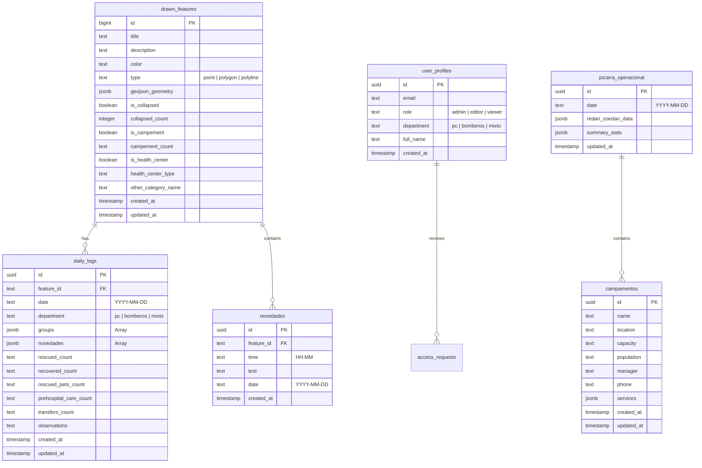

# 🗄️ Esquema de Base de Datos y Políticas RLS (Supabase PostgreSQL)

Este documento detalla la estructura del modelo de datos relacional y JSONB implementado en PostgreSQL a través de Supabase para la **App de Mapas — COE La Guaira**.

---

## 📊 Diagrama Entidad-Relación



---

## 📑 Diccionario de Tablas Principales

### 1. `drawn_features` (Elementos Geográficos del Mapa)
Almacena todos los puntos de interés, polígonos (sectores) y líneas trazados en la cartografía.

| Columna | Tipo | Descripción |
| :--- | :--- | :--- |
| `id` | `bigint` (PK) | Identificador numérico secuencial del feature. |
| `title` | `text` | Nombre o título descriptivo del sitio/área. |
| `description` | `text` | Descripción detallada de la ubicación o situación. |
| `color` | `text` | Código hexadecimal del color del marcador/polígono (ej. `#ef4444`). |
| `type` | `text` | Tipo de geometría: `'point'`, `'polygon'`, `'polyline'`. |
| `geojson_geometry` | `jsonb` | Objeto estándar GeoJSON (`Point`, `Polygon`, `LineString`). |
| `is_collapsed` | `boolean` | Indica si el punto representa una estructura colapsada. |
| `collapsed_count` | `integer` | Número de personas atrapadas o afectadas estimadas. |
| `is_campement` | `boolean` | Indica si el punto es un campamento / albergue temporal. |
| `is_health_center` | `boolean` | Indica si es un centro de salud (CDI, Hospital, Ambulatorio). |
| `health_center_type` | `text` | Tipo de centro de salud. |

---

### 2. `daily_logs` (Bitácora Diaria Operativa)
Almacena el registro operacional diario de cada punto o polígono por fecha e institución.

| Columna | Tipo | Descripción |
| :--- | :--- | :--- |
| `id` | `uuid` (PK) | Identificador único del registro de bitácora. |
| `feature_id` | `text` (FK) | ID del feature asociado en `drawn_features`. |
| `date` | `text` | Fecha del reporte en formato ISO `YYYY-MM-DD`. |
| `department` | `text` | Departamento: `'pc'` (Protección Civil), `'bomberos'`, `'mixto'`. |
| `groups` | `jsonb` | Arreglo de grupos de oficiales desplegados y contenedor de actividades personalizadas (`__custom_meta__`). |
| `novedades` | `jsonb` | Arreglo de novedades del día con hora y detalle. |
| `rescued_count` | `text` | Número de personas rescatadas con vida. |
| `recovered_count` | `text` | Número de víctimas recuperadas sin vida. |
| `rescued_pets_count` | `text` | Número de mascotas / animales rescatados. |
| `prehospital_care_count` | `text` | Número de atenciones prehospitalarias brindadas. |
| `transfers_count` | `text` | Número de traslados a centros asistenciales. |
| `observations` | `text` | Observaciones generales del día para el punto. |

#### Estructura del JSONB `groups`:
```json
[
  {
    "id": "uuid-grupo",
    "groupName": "Grupo 2-B",
    "officersCount": "12",
    "unitOut": "Unidad 1534, Ambulancia 02",
    "departureTime": "08:00",
    "arrivalTime": "08:25",
    "hasArrived": true,
    "managerName": "Oficial Pérez",
    "managerPhone": "0412-1234567",
    "commissionId": "independiente"
  },
  {
    "id": "__custom_meta__",
    "groupName": "",
    "customActivities": [
      {
        "id": "act-1",
        "name": "Demolición controlada",
        "value": "1",
        "description": "Trabajos de demolición de muro inestable"
      }
    ]
  }
]
```

---

## 🔒 Políticas de Seguridad (Row Level Security — RLS)

Todas las tablas en PostgreSQL tienen RLS habilitado para garantizar que solo usuarios autenticados y con los roles adecuados puedan modificar los datos.

```sql
-- Habilitar RLS en tablas críticas
ALTER TABLE public.drawn_features ENABLE ROW LEVEL SECURITY;
ALTER TABLE public.daily_logs ENABLE ROW LEVEL SECURITY;
ALTER TABLE public.novedades ENABLE ROW LEVEL SECURITY;
ALTER TABLE public.campamentos ENABLE ROW LEVEL SECURITY;
ALTER TABLE public.pizarra_operacional ENABLE ROW LEVEL SECURITY;

-- Política de Lectura Pública/Autenticada:
CREATE POLICY "Permitir lectura general a usuarios autenticados"
ON public.drawn_features FOR SELECT TO authenticated USING (true);

-- Política de Escritura (Solo usuarios con rol editor o admin):
CREATE POLICY "Permitir inserción y actualización a editores"
ON public.drawn_features FOR ALL TO authenticated
USING (public.has_perm(auth.uid(), 'editor') OR public.is_admin(auth.uid()))
WITH CHECK (public.has_perm(auth.uid(), 'editor') OR public.is_admin(auth.uid()));
```

---

## ⚡ Sincronización en Tiempo Real (Realtime)

Las tablas `drawn_features`, `daily_logs` y `novedades` forman parte de la publicación `supabase_realtime`:

```sql
ALTER PUBLICATION supabase_realtime ADD TABLE public.drawn_features;
ALTER PUBLICATION supabase_realtime ADD TABLE public.daily_logs;
ALTER PUBLICATION supabase_realtime ADD TABLE public.novedades;

-- Replica Identity FULL para recibir el registro previo en eventos UPDATE / DELETE
ALTER TABLE public.drawn_features REPLICA IDENTITY FULL;
ALTER TABLE public.daily_logs REPLICA IDENTITY FULL;
```
